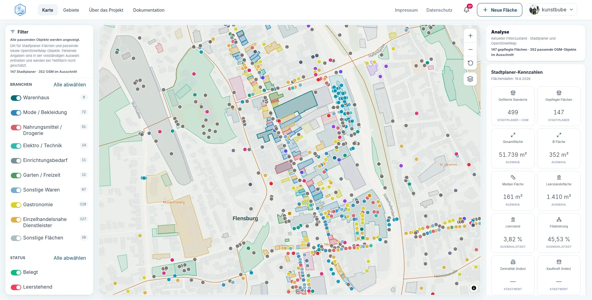
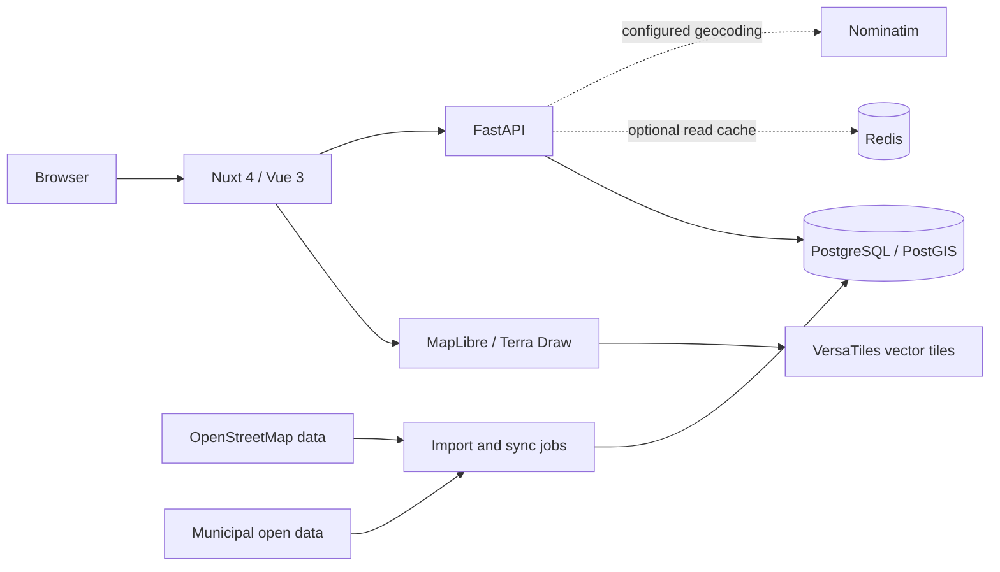

# Open City Planner

**An open-source Web GIS for exploring, drawing, and analyzing urban areas.**

Open City Planner is a civic-tech project by [OK Lab Flensburg](https://oklabflensburg.de/) that brings together OpenStreetMap, public data, and modern spatial analysis in an accessible web interface. The production instance currently uses Flensburg, Germany, as its reference implementation.

**Making urban GIS accessible beyond GIS specialists.**

[Live demo](https://stadtplaner.oklabflensburg.de/) · [Explore the map](https://stadtplaner.oklabflensburg.de/karte) · [Documentation](https://stadtplaner.oklabflensburg.de/dokumentation) · [Contributing](CONTRIBUTING.md)

[](https://github.com/oklabflensburg/open-city-planner/actions/workflows/backend.yml)
[](https://github.com/oklabflensburg/open-city-planner/actions/workflows/frontend.yml)
[](https://github.com/oklabflensburg/open-city-planner/actions/workflows/e2e.yml)
[](https://github.com/oklabflensburg/open-city-planner/actions/workflows/security.yml)



## Why Open City Planner?

Traditional GIS tools are powerful, but they often assume specialist knowledge. Open City Planner explores how spatial planning, OpenStreetMap data, and municipal open data can be made accessible through a modern browser interface.

The goal is not to replace professional GIS software. It is to make common urban exploration and spatial analysis workflows easier to understand, use, and share.

## What can you do with it?

- Explore OpenStreetMap features alongside curated public city data.
- Search for addresses, places, businesses, and analysis areas on the map.
- Select districts and statistical areas and inspect their polygons, POIs, spatial metrics, and available municipal statistics.
- Filter and analyze mapped areas by attributes such as industry, floor, size, and occupancy status.
- Compare districts and other analysis areas using a shared set of metrics.
- Draw and save your own polygons with Terra Draw and manage them from your account.

Public information can be explored without an account. Authentication and authorization for editing and administrative workflows are enforced by the backend.

## Try it

- [Open the live application](https://stadtplaner.oklabflensburg.de/)
- [Explore the interactive map](https://stadtplaner.oklabflensburg.de/karte)
- [Open Flensburg Altstadt as a selected example area](https://stadtplaner.oklabflensburg.de/karte?gebiet=altstadt-15630273)

The Altstadt link opens the map with an existing district selected, providing a direct example of the area-selection and analysis workflow.

## Architecture

The application combines a server-rendered web frontend, a spatial API, and reproducible data and deployment workflows.



Core technologies:

- **Frontend:** Nuxt 4, Vue 3, Pinia, Tailwind CSS, MapLibre, and Terra Draw.
- **Backend:** FastAPI, SQLAlchemy, GeoAlchemy2, and Alembic.
- **Data and infrastructure:** PostgreSQL/PostGIS, an optional Redis read cache, OpenStreetMap imports, VersaTiles, configured Nominatim integration, and municipal statistics.
- **Delivery:** GitHub Actions for backend, frontend, migrations, E2E, security, and supply-chain checks; Ansible, Nginx, and systemd for production deployment.

PostgreSQL/PostGIS remains the domain source of truth. Redis can cache public reads, and production deployments can also use it for shared security counters.

## Use Open City Planner for another city

Flensburg is the current reference deployment, but the project is being developed with reuse by other cities and civic-tech initiatives in mind.

Some datasets, administrative boundaries, statistics, and external integrations are city-specific today and will require local adaptation. The project does not yet provide one-click deployment for arbitrary cities.

If you are interested in adapting Open City Planner for another city, [open an issue](https://github.com/oklabflensburg/open-city-planner/issues) and tell us about your data, goals, and use case.

## Repository structure

```text
backend/          API, data models, migrations, CLI tools, and tests
frontend/         Web application, public user guide, and E2E tests
docs/             Development, architecture, data, and operations documentation
deploy/ansible/   Reproducible production deployment
deploy/nginx/     Application-specific Nginx hardening templates
deploy/systemd/   Units for the application and background jobs
scripts/osm/      Initial OpenStreetMap import and replication updates
```

## Local development

The exact development runtimes are defined in `.python-version`, `.node-version`, and `frontend/package.json`. You also need uv 0.12.5 and PostgreSQL with PostGIS.

Set up and start the backend:

```bash
cd backend
cp .env.example .env
python3 -m pip install 'uv==0.12.5'
uv sync --frozen --extra dev
uv run alembic upgrade head
uv run uvicorn app.main:app --reload
```

Start the frontend in a second terminal:

```bash
cd backend
export OCP_BACKEND_MODULES="$(../scripts/backend-module-inventory --format env)"
cd ../frontend
cp .env.example .env
pnpm install --frozen-lockfile
pnpm dev
```

`ENABLED_MODULES` in `backend/.env` is the backend activation decision;
`OCP_FRONTEND_MODULES` in `frontend/.env` is the frontend activation decision.
The command above derives the versioned compatibility inventory from backend
discovery, so module versions are not entered a second time.

The frontend runs at `http://localhost:3000` by default, the API at `http://localhost:8000`, and Swagger UI at `http://localhost:8000/docs`.

The local database must have the PostGIS extension enabled. Review every value in the environment examples before production use, and never reuse development secrets in production.

## Tests

Run backend linting and tests:

```bash
cd backend
.venv/bin/ruff check app tests
.venv/bin/pytest
```

Run the frontend unit tests, TypeScript checks, production build, and German UI language audit:

```bash
cd ../frontend
pnpm test
pnpm typecheck
pnpm build
pnpm audit:language
```

The E2E suite starts the frontend and backend in an isolated test environment:

```bash
cd frontend
pnpm test:e2e
```

See [docs/ci.md](docs/ci.md) for the complete CI jobs and stable check names.

## Documentation

The public user documentation is available [in the live application](https://stadtplaner.oklabflensburg.de/dokumentation) and is generated from `frontend/app/config/documentation.ts`. Most user and operations documentation is currently written in German.

### Development and architecture

- [Technical documentation](docs/README.md)
- [Intelligent search](docs/intelligent-search.md)
- [Open City Planner assistant](docs/stadtplaner-assistant.md)
- [Reproducible supply chain](docs/supply-chain.md)

### Operations and security

- [Deployment and operations](docs/deployment.md)
- [Production observability](docs/observability.md)
- [Ansible deployment](deploy/ansible/README.md)
- [Nginx hardening and rate limits](deploy/nginx/README.md)
- [Production security checklist](docs/security/production-checklist.md)

### Data

- [OpenStreetMap data](docs/osm-data.md)
- [Municipal statistics for Flensburg](docs/flensburg-statistics.md)

## Contributing

Contributions are welcome—not only code. We are especially interested in contributions around:

- GIS and MapLibre user experience;
- OpenStreetMap integrations;
- PostGIS and spatial analysis;
- accessibility;
- open-data integrations;
- documentation and translations;
- making the application reusable for other cities.

Read [CONTRIBUTING.md](CONTRIBUTING.md) for the development and pull-request workflow. Report security vulnerabilities according to [SECURITY.md](SECURITY.md), not in a public issue.

## License and data sources

Open City Planner source code is licensed under the **GNU Affero General Public License v3.0 (AGPL-3.0-only)**. See [LICENSE](LICENSE) for the complete license terms.

The AGPL permits use, distribution, and modification of the source code and requires corresponding source availability when modified versions are provided to users over a network.

OpenStreetMap data remains subject to its applicable ODbL attribution requirements. Municipal statistics retain the source, period, and license recorded for each dataset. Other integrated data and dependencies retain their respective licenses.
