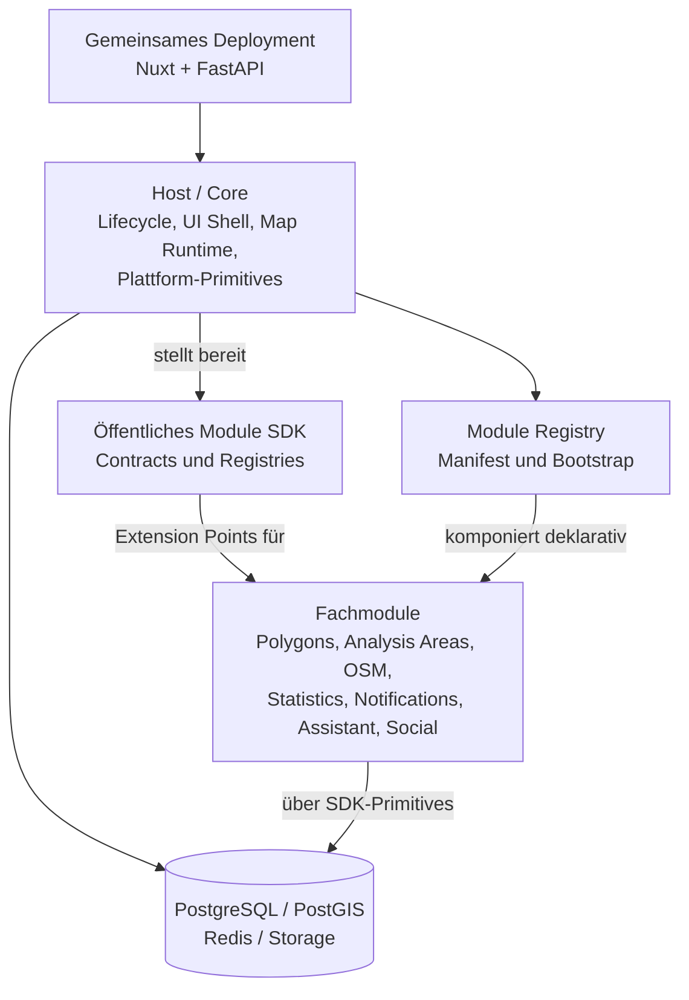
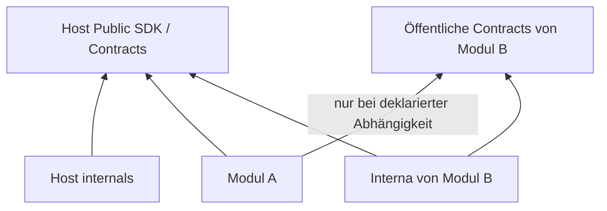
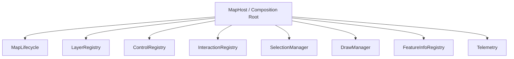
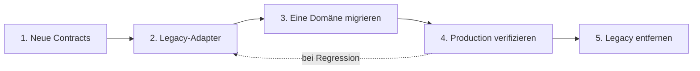

# ADR: Modularer Host und Grenzen von Fachmodulen

> Dieses ADR dokumentiert den Ausgangszustand und die Zielgrenzen zum Zeitpunkt
> der Entscheidung. Den umgesetzten Slim-Host-Stand beschreibt das
> [Extraktionsinventar](../modules/slim-host-extraction-inventory.md).

- Status: Angenommen
- Datum: 2026-08-25
- Entscheidung: [Issue #92](https://github.com/oklabflensburg/open-city-planner/issues/92)
- Epic: [Issue #91](https://github.com/oklabflensburg/open-city-planner/issues/91)

## Kontext

Open City Planner ist heute eine produktiv eingesetzte Web-GIS-Anwendung. Backend und
Frontend sind überwiegend nach technischen Schichten organisiert:

```text
backend/app/{api,models,schemas,services,integrations}
frontend/app/{pages,components,composables,stores}
```

Diese Struktur ist für eine einzelne Anwendung nachvollziehbar und bleibt der
funktionierende Ausgangspunkt. Mit wachsender Zahl an Fachfunktionen führt sie jedoch
dazu, dass neue Domänen häufig zentrale Dateien und globale Strukturen erweitern:

- `backend/app/api/router.py` importiert und registriert alle Fachrouter zentral.
- `backend/alembic/env.py` lädt fachliche ORM-Modelle für ein gemeinsames
  `Base.metadata` zentral.
- `backend/app/core/config.py` enthält Plattform- und Fachkonfiguration in einem
  Settings-Schema.
- `backend/app/services/assistant.py` orchestriert unter anderem Intent-Erkennung,
  Gebietsauflösung, Provider, Tools, Antwortdarstellung und Telemetrie.
- `frontend/app/composables/useSiteNavigation.ts` definiert die Navigation zentral.
- `frontend/app/components/map/MapCanvas.vue` vereint MapLibre-Lifecycle,
  Fach-Layer, Viewport-Laden, Interaktionen, Auswahl und Performance-Verhalten.
- `frontend/app/stores/auth.ts` bündelt Session, Login, Refresh, OAuth, MFA,
  Passkeys und Profiloperationen.

Das ist keine pauschale Abwertung der bestehenden Architektur. Das ADR legt die
Grenzen für ihre inkrementelle Weiterentwicklung fest und setzt noch keine neue
Modulruntime um.

Die Entscheidung stimmt mit den bestehenden Vorhaben überein:

- [#21](https://github.com/oklabflensburg/open-city-planner/issues/21) fordert
  testbare Grenzen für Assistant, Karte und Auth.
- [#33](https://github.com/oklabflensburg/open-city-planner/issues/33) trennt
  generische Civic-Geodatenmodelle von lokalen Annahmen und schützt Provenienz und
  Lizenzen.
- [#34](https://github.com/oklabflensburg/open-city-planner/issues/34) entwickelt
  versionierte, interoperable Geo-APIs und Exportverträge.
- [#35](https://github.com/oklabflensburg/open-city-planner/issues/35) trennt
  OSM-/Open-Data-Importer, kanonisches Modell und Präsentation.
- [#83](https://github.com/oklabflensburg/open-city-planner/issues/83) ist ein
  künftiger Consumer der Modul- und Karten-Extension-Points, keine parallele
  Plugin-Architektur.

## Entscheidung

Open City Planner wird als **modularer Monolith aus Host, öffentlichem Module SDK und
Fachmodulen** weiterentwickelt. Nuxt, FastAPI und die gemeinsam betriebenen
Infrastrukturkomponenten bleiben Composition Roots. Module erweitern den Host über
deklarative Manifeste und stabile Registrierungsverträge; der Host importiert keine
konkrete Fachdomäne.



Dies ist weder eine Microservice-Migration noch ein Runtime-Microfrontend-System.
Module ändern standardmäßig nicht die Prozessarchitektur und werden vor dem Build
installiert und aktiviert. Die Kerntechnologien bleiben:

- Frontend: Nuxt 4, Vue, TypeScript, Pinia, Tailwind und MapLibre;
- Backend: FastAPI, Python, SQLAlchemy, Alembic, PostgreSQL/PostGIS und Redis;
- Betrieb: GitHub Actions, Ansible und die bestehende Observability.

## Begriffe und harte Grenzen

**Host/Core** bezeichnet ausschließlich dauerhaft fachneutrale
Plattformverantwortung. **Module SDK** bezeichnet die versionierte öffentliche
Oberfläche des Hosts, die Module verwenden dürfen. **Fachmodul** bezeichnet einen
fachlich abgegrenzten Besitzer von Verhalten, Daten, Verträgen und Beiträgen.

Der Host ist kein Ablageort für schwer einzuordnenden Code. Code wird nur dann Host,
wenn er fachneutral ist, von mehreren unabhängigen Modulen benötigt wird und als
stabiler Plattformvertrag verantwortet werden kann. Wiederverwendung allein macht
Fachlogik nicht zum Host-Service.

### Abhängigkeitsrichtung

Die Pfeile im folgenden Diagramm bedeuten „darf zur Build-/Importzeit abhängen von“:



Verbindlich gilt:

- Der Host kennt kein konkretes Fachmodul und importiert keines.
- Module dürfen nur das öffentliche Host-SDK verwenden, nicht Host-Interna.
- Ein Modul darf öffentliche Contracts eines anderen Moduls nur über eine im
  Manifest deklarierte Abhängigkeit verwenden.
- Ein Modul darf keine internen APIs, Persistence-Pakete oder ORM-Modelle eines
  anderen Moduls importieren.
- Zirkuläre Modulabhängigkeiten sind verboten.
- Bootstrap und Discovery erfolgen durch die Host-Registry aus deklarativer
  Konfiguration beziehungsweise Packaging-Metadaten, nicht durch fachliche Imports
  im Host.

### Public API und Interna

Konzeptionelle Namenskonvention für Python ist
`modules.<module_id>.contracts` als einziger modulübergreifend importierbarer
Namensraum. `modules.<module_id>.internal`, `.persistence`, `.application` und
`.integrations` bleiben intern. Frontend-Pakete exportieren modulübergreifende Typen
und Beiträge ausschließlich über einen expliziten `contracts`-/Public-Entry-Point;
Deep Imports in interne Pfade sind verboten. Die endgültige Paket- und
Manifest-Syntax wird in #93 festgelegt.

## Ownership Matrix

| Capability | Host/Core besitzt | Fachmodul besitzt |
|---|---|---|
| Application Lifecycle | Startup, Shutdown, Composition Roots, Bootstrap-Reihenfolge | registrierte Lifecycle-Beiträge |
| Health | Liveness-/Readiness-Aggregation und Basiszustand | eigener Health-Beitrag ohne globale Route zu patchen |
| Configuration | Laden, Validieren, Namespacing, Secret-Zugriffsmechanismus | Settings-Schema, Defaults und fachliche Werte |
| Datenbank | Engine, Session Factory, Transaktionen, DB Health | fachliche Tabellen, Repositories und Datenregeln |
| PostGIS | Extension und gemeinsame räumliche Primitives | fachliche Geometrien und Abfragen |
| Migrationen | Koordination, Reihenfolge und Alembic-Lifecycle | Migrationen der eigenen Tabellen |
| Identity/Auth | aktuelle Identity, Session-/Auth-Kontext, CSRF und etablierte OAuth-/Passkey-/MFA-Infrastruktur | fachliche Nutzung des Auth-Kontexts |
| Permissions | Permission Engine und Auswertung | stabile fachliche Permission-IDs und Regeln |
| Events/Outbox | Transport, Dispatch und transaktionale Mechanik | Domain Events und Handler der eigenen Domäne |
| Cache | Redis-Verbindung und sichere Cache-Primitives | Keys, TTLs, Cache Policy und Invalidierung |
| Observability | Logging, Metrics, Tracing, Request IDs und Build Info | fachliche Logs, Metriken und Spans über das SDK |
| Storage | abstrahierte Storage-Primitives und Sicherheitsgrenzen | Dateien, Medien und Aufbewahrungsregeln der Domäne |
| Jobs | Registry, Scheduling-/Execution-Primitives und Beobachtbarkeit | Job-Definitionen, fachliche Retries und Idempotenz |
| HTTP Clients | sichere Clients, Timeouts, Telemetrie und Basis-Policies | Provider-Adapter, Endpunkte und fachliche Fehlerbehandlung |
| Module Registry | Discovery, Validierung, Kompatibilität und Enablement | Manifest und deklarierte Beiträge |
| UI Shell | App Shell, Basislayout, globale Accessibility, Branding und Error Boundary | fachliche Seiten, Ansichten und UI-Beiträge |
| Navigation | Registries, Sortierung, Sichtbarkeitsauswertung | Navigationseinträge mit stabilen IDs |
| Map Runtime | MapLibre-Lifecycle, Registries, Selection-/Interaction-Primitives, Rendering-Basis | konkrete Fachdaten-Layer, Controls und Interaktionen |
| API | Router-Registry, gemeinsame Middleware und Fehler-Primitives | Routen und fachliche Request-/Response-Verträge |
| Fachliche Datenprovenienz | technische Transportmöglichkeit | Quelle, Lizenz, Datenstand und Transformationssemantik |

### Dauerhafte Host-Verantwortung

Der Host verantwortet:

1. **Application Lifecycle:** FastAPI-/Nuxt-Composition-Root, Startup, Shutdown,
   Module Bootstrap und Health-Lifecycle.
2. **Configuration Framework:** typsicheres Laden, Namespacing, Validierung und
   kontrollierter Secret-Zugriff. Fachliche Settings wachsen nicht weiter in ein
   globales Core-Schema.
3. **Database Primitives:** Engine, Session Factory, Transaktionsgrenzen, PostGIS-
   Extension-Ownership und grundlegende DB-Health-Prüfung.
4. **Identity-/Authentication-Primitives:** aktuelle Identity, Auth-Kontext,
   Sessions und die bestehende Sicherheitsinfrastruktur für Cookies, CSRF, OAuth,
   Passkeys und MFA, soweit sie plattformweit ist. Fachliche Rollen und Permissions
   werden registrierbar.
5. **Permission Engine:** Registrierung und einheitliche serverseitige Auswertung;
   die Semantik fachlicher Permissions bleibt beim Modul.
6. **Event-/Outbox-Infrastruktur:** Publisher-/Subscriber-Verträge, Dispatch und
   transaktionale Zustellung, nicht die fachlichen Ereignisse.
7. **Cache, Storage, Jobs und HTTP-Client-Infrastruktur:** robuste Primitives und
   Registries, nicht fachliche Policies oder Providerlogik.
8. **Observability:** strukturierte Logs, Metriken, Tracing, Request-/Correlation-ID,
   Build-Information und fehlertolerante Telemetrie.
9. **Module Registry:** Discovery, deterministischer Bootstrap, Validierung,
   Kompatibilitätsprüfung, Status und Capabilities.
10. **UI Shell:** globale App Shell, Basislayout, Branding-Primitives, globale
    Accessibility und Error Boundary.
11. **Map Runtime:** gemeinsame MapLibre-Instanz und deren Lebenszyklus,
    Extension-Registries, Selection-/Interaction-Primitives und Rendering-Basis.

Auth ist sicherheitskritisch, umfasst bereits viele öffentliche und interne Verträge
und wird ausdrücklich **nicht als erste Domäne migriert**. Verstecken von UI-Beiträgen
ersetzt niemals die serverseitige Autorisierung.

### Was nicht zum Host gehört

Folgende Fachlichkeiten bleiben beziehungsweise werden Module oder klar abgegrenzte
Adapter; sie werden nicht zu Core umetikettiert:

- User Polygons und Verkaufsflächen;
- Analysis Areas und kommunale Statistik;
- OSM-Fachlogik und konkrete Open-Data-Importer;
- Layer Catalog als Fachfunktion sowie konkrete Biotop-, ALKIS- und Denkmal-Layer;
- Assistant-Planung, Tools und Antwortlogik;
- Social Publishing und Mastodon-Fachintegration;
- Notification Business Logic und E-Mail-Kampagnen;
- konkrete Provider-, Provenienz- und Transformationsregeln.

## Modulinterne Architektur

Ein ausreichend großes Modul darf langfristig folgende Schichten besitzen:

```text
module/
├── api/
├── application/
├── domain/
├── persistence/
├── integrations/
├── contracts/
└── tests/
```

Nicht jedes kleine Modul benötigt jedes Verzeichnis. Die bevorzugte Richtung ist
`API -> Application -> Domain`. Persistence und Integrationen implementieren Ports
beziehungsweise Contracts, die von innen definiert werden. Die Domain bleibt, wo
sinnvoll, frei von FastAPI-, Vue- und SQLAlchemy-Abhängigkeiten. Dies ist eine
pragmatische Trennungsregel und keine Pflicht zu dogmatischer Clean-Architecture-
Zerlegung.

Ein Modul besitzt:

- seine fachlichen Begriffe, Use Cases und Validierung;
- seine öffentlichen Service-/Query-Contracts und Domain Events;
- seine API-Routen und Response-Verträge;
- seine Tabellen, Repositories, Migrationen und Cache Policy;
- seine Provider-Adapter und fachlichen Jobs;
- seine Permissions, Capabilities, UI- und Kartenbeiträge;
- seine Tests, Dokumentation, Version und Kompatibilitätsangaben.

## Cross-Module-Kommunikation

Es gibt drei bevorzugte Mechanismen:

1. **Query-/Service-Contracts** für synchrone fachliche Abfragen, zum Beispiel ein
   `AnalysisAreaQueryService`. Contracts transportieren DTOs oder Protokolle, keine
   SQLAlchemy-Modelle und keine interne Session.
2. **Domain Events** für lose gekoppelte Reaktionen. Ein `PolygonCreated` gehört dem
   Polygon-Modul; Notifications, Social oder Analytics dürfen reagieren, ohne dass
   der Producer sie kennt. Der Host stellt nur Transport und Zustellung bereit.
3. **Shared Platform Services** ausschließlich für echte Plattformkonzepte wie
   Cache, Storage, Events, Metrics, Settings und DB-/Transaktionsprimitives.

Die Service Registry ist nur für öffentliche Cross-Module-Contracts vorgesehen. Sie
ist kein allgemeiner Service Locator und keine Möglichkeit, Abhängigkeiten zu
verbergen. Events repräsentieren relevante, abgeschlossene fachliche Tatsachen; nicht
jeder interne Methodenaufruf wird zu einem Event.

## Geplante Backend-Extension-Points

Die folgenden Extension-Points sind verbindliches Zielbild, werden in diesem ADR
aber noch nicht implementiert:

| Extension Point | Verantwortung des Moduls | Verantwortung des Hosts |
|---|---|---|
| API router | Router, Prefix-/Tag-Metadaten und fachliche Abhängigkeiten liefern | validieren und ohne Patch am zentralen Router registrieren |
| Lifecycle hook | idempotenten Startup-/Shutdown-Beitrag deklarieren | Reihenfolge, Fehlerisolation und Shutdown koordinieren |
| Public service contract | Contract-ID, Version und Implementierung bereitstellen | Eindeutigkeit, Auflösung und deklarierte Dependencies prüfen |
| Event publisher/subscriber | eigenes Event publizieren oder Handler registrieren | Dispatch, Transaktionsbezug, Retry und Beobachtbarkeit stellen |
| Permission | stabile ID und fachliche Beschreibung definieren | Duplikate verhindern und Auswertung bereitstellen |
| Job | Job-ID, Handler, Schedule-Anforderung und Idempotenz definieren | Registry, Ausführung, Locking und Telemetrie koordinieren |
| Health/readiness | begrenzten, timeoutfähigen Status beitragen | Beiträge aggregieren, ohne Liveness unnötig zu koppeln |
| Settings schema | namespaced Schema samt Defaults/Validierung liefern | laden, Secrets schützen und Fehler beim Bootstrap melden |
| Persistence metadata/migrations | eigene Metadata und Migrationen liefern | Reihenfolge und Alembic-Ausführung koordinieren |
| Capability | stabile Capability-ID und Status deklarieren | Eindeutigkeit und Abfrage über Registry bereitstellen |

Die konkreten APIs entstehen in #94 bis #100, #104 und #111. Ein neues
Backend-Modul muss danach ohne Änderung an `backend/app/main.py` und
`backend/app/api/router.py` registrierbar sein.

## Geplante Frontend-Extension-Points

Das Build-Time-Modell bietet langfristig Registries für:

- `pages/routes`;
- `navigation.primary`, `navigation.user` und `navigation.admin`;
- `header.actions`, `sidebar`, `dashboard.widgets` und `profile.sections`;
- `map.controls`, `map.layers`, `map.interactions`, `map.feature-info`,
  `map.analysis-provider`, `map.context-menu` und `map.bottom-sheet`.

Für jeden Beitrag gelten folgende Regeln:

- Er hat eine über Builds stabile, global eindeutige und vom Modul namespacete ID.
- Sortierung ist deterministisch über definierte Gruppen/Prioritäten; Reihenfolge
  darf nicht von Discovery- oder Importreihenfolge abhängen.
- Sichtbarkeit kann von Capabilities und Permissions abhängen. Die UI verwendet den
  zentralen Auth-Kontext; Autorisierung bleibt trotzdem serverseitig.
- Registrierung liefert einen Lifecycle beziehungsweise eine Unregister-Möglichkeit,
  damit Deaktivierung, Tests und Hot Reload keine doppelten Beiträge hinterlassen.
- Beiträge müssen SSR-kompatibel sein. Browser-only Code und MapLibre-Zugriff werden
  erst clientseitig im dafür vorgesehenen Lifecycle ausgeführt.
- Unbekannte oder deaktivierte Beiträge dürfen SSR und die globale App Shell nicht
  beschädigen; Registrierungsfehler sind beobachtbar.

Die genaue Nuxt-Integration und Distribution werden in #101, UI-Registries in #102
bestimmt. Es werden keine beliebigen Vue-Bundles zur Laufzeit von externen URLs
geladen und keine Runtime-Microfrontends eingeführt.

## Map Runtime

`MapCanvas.vue` wird langfristig zum kleinen Composition Root. Die Zielzerlegung ist:



Der Host besitzt MapLibre-Lifecycle, stabile Registries, gemeinsame Auswahl- und
Interaktionsregeln sowie die Rendering-Basis. Fachmodule besitzen ihre Sources,
Layer, Controls, Feature-Info-Provider und fachlichen Interaktionen. Konflikte wie
Layer-Reihenfolge, exklusive Interaktionsmodi, Cleanup und Telemetrie werden durch
Map-Runtime-Verträge gelöst, nicht durch gegenseitige Modulimporte.

Diese Zerlegung gehört zu #103 und setzt die Characterization-Tests aus #21 voraus.
Dieses ADR ändert `MapCanvas.vue` nicht. Der Layer-Katalog aus #83 konsumiert später
dieselben Extension-Points.

## Datenbank- und Migrationsgrenzen

- PostgreSQL/PostGIS bleibt eine gemeinsame Datenbank. Eine Datenbank pro Modul ist
  kein Ziel.
- Jedes Modul besitzt seine fachlichen Tabellen, Geometrien und Migrationen.
- Der Host koordiniert Migrationen, Reihenfolge, Transaktionen und den bestehenden
  Alembic-Lifecycle.
- Kein Modul verändert Tabellen eines fremden Moduls.
- Die veröffentlichte Alembic-Historie bleibt intakt; es gibt weder Neuaufbau noch
  Neuinitialisierung der Production-Datenbank.
- Cross-Module-Foreign-Keys sind bewusste, seltene Ausnahmen. Cross-Module-
  Geospatial-Queries bleiben möglich, werden aber über Application-/Query-Services
  angeboten statt durch fremde ORM-Imports.

Als bevorzugte Richtung wird ein PostgreSQL-Schema pro Modul evaluiert, weil es
Ownership sichtbar macht und Namenskollisionen reduziert. Falls Alembic-, PostGIS-
oder Betriebsanforderungen dagegen sprechen, ist ein konsistentes Tabellen-Namespace
die Alternative. Die endgültige Wahl, Legacy-Zuordnung und Migrationsmechanik trifft
#97; dieses ADR nimmt keine Schemaänderung vor.

## Konfiguration, Events und Manifest

Der Host stellt den Konfigurationsmechanismus bereit; jedes Modul registriert ein
namespaced Settings-Schema und besitzt seine fachlichen Werte. Module erhalten nur
die benötigten Secrets über kontrollierte SDK-Primitives. Details folgen in #99.

Ein Domain Event gehört immer dem Modul, das den fachlichen Zustand besitzt. Der
Name `PolygonCreated` ist deshalb korrekt, `CorePolygonCreated` nicht. Payloads sind
versionierte Contracts und enthalten keine ORM-Instanzen oder unnötigen
personenbezogenen Daten. Zustellungs- und Outbox-Semantik folgen in #96.

Das Modulmanifest ist die zentrale deklarative Identität. Es wird mindestens ID,
Version, Host-/SDK-Kompatibilität, Dependencies, Capabilities und Permissions
beschreiben. Exaktes Format, SemVer-Regeln und Dependency-Auflösung gehören zu #93;
das Manifest bleibt kompakt und wird nicht zum imperativen Bootstrap-Skript.

## Trust, Distribution und Kompatibilität

Installierte Python- und Nuxt-Module laufen im Prozess mit Host-Rechten. Sie sind
**trusted code und nicht sandboxed**. Es wird keine Sicherheitsisolation behauptet,
die der Prozess nicht erzwingt. Untrusted Integrationen laufen out-of-process und
verwenden begrenzte Verträge wie HTTP, OGC, Tiles, Webhooks oder Events. Die genaue
Klassifizierung und Review-/Signaturregeln folgen in #109.

Frontend-Module werden vor dem Build installiert und aktiviert. Es gibt im ersten
System keinen Runtime-Download von Plugin-Code. Nuxt Layers/Modules werden in #101
evaluiert.

Host, SDK und Module werden langfristig separat mit SemVer versioniert. Ein Modul
deklariert unterstützte Host-/SDK-Versionen; „latest funktioniert immer“ ist kein
Vertrag. Breaking Changes benötigen eine neue Major-Version. Deprecations müssen
dokumentiert, beobachtbar und für mindestens einen angekündigten Migrationszeitraum
parallel nutzbar sein. Details und die genaue Compatibility-Matrix gehören zu #93.

## Compatibility Invariants

Die Modularisierung darf ohne eigenes explizites Issue und Migrationskonzept keine
der folgenden Production-Verträge brechen:

- bestehende API-URLs und JSON-Response-Contracts;
- Authentication Behaviour sowie Cookie-/CSRF-Verhalten;
- SSR-URLs, Canonicals, öffentliche Seiten und Map-URLs;
- bestehende DB-Daten und veröffentlichte Migrationen;
- E-Mail-, Notification- und Social-Flows;
- Deployment Health, Rollback-Fähigkeit und Observability.

Legacy-Adapter dürfen intern neue Contracts bedienen, während die öffentlichen
Verträge unverändert bleiben. Provenienz, Lizenz und Attribution externer Daten
bleiben bei Modulgrenzen erhalten.

## Inkrementelle Migration

Die Migration folgt einem Strangler-Muster. Bestehende Implementierungen bleiben
zunächst aktiv:



Es werden nicht zuerst Verzeichnisse massenhaft verschoben. Jede Stufe bleibt
deploybar und bewahrt bestehende API-, SSR-, Auth-, Daten- und Betriebsverträge.
Neue Modulpfade sind kontrolliert aktivierbar; eine Pilotmigration kann, soweit
sinnvoll, auf den Legacy-Pfad zurückschalten. Enable/Disable-, Upgrade- und
Datenhaltungsregeln werden in #112 festgelegt.

### Temporäre Git-Integrationslinie für Epic #91

Während des Epics gilt:

```text
main (Production/stabile Hauptlinie)
  └─ staging/epic-91-modular-host (temporäre Epic-Integration)
       └─ feat/<issue>-... oder docs/<issue>-...
            └─ Pull Request zurück auf staging/epic-91-modular-host
```

- Kein Epic-Feature-PR zielt direkt auf `main`.
- Pro Issue wird ein kurzer Feature-Branch von der aktuellen Staging-Branch erstellt
  und nach dem Merge nicht weiterverwendet.
- Nach jedem Merge bleiben Backend- und Frontendtests, Typecheck, Build,
  Security-/Architecture-Gates und relevante E2E-Tests grün.
- Die Staging-Branch nimmt regelmäßig `main` auf, damit Production-Fixes nicht
  auseinanderlaufen.
- Erst wenn die Gates aus #91 erfüllt sind, wird ein finaler Integrations-PR von
  `staging/epic-91-modular-host` nach `main` erstellt. Danach wird die temporäre
  Staging-Branch entfernt.

## Pilotdomäne

Für #107 werden **Analysis Areas** und **Statistics** als Kandidaten bewertet:

| Kandidat | Eignung | Risiken |
|---|---|---|
| Analysis Areas | abgegrenzte, überwiegend lesende Domäne; prüft API, Persistence, Frontend und Map-Beitrag End-to-End | öffentliche URLs/Responses und räumliche Beziehungen müssen über Legacy-Adapter stabil bleiben |
| Statistics | fachlich erkennbarer Datenbesitz und gute Query-Service-Grenze | lokale Importannahmen, Analytics-Kopplung und Provenienzarbeit aus #33/#34 erhöhen den Vorlauf |

Empfohlen wird **Analysis Areas** als Pilot, weil die Domäne die wesentlichen
Extension-Points repräsentativ validiert, ohne die gesamte Map Runtime zu migrieren.
Die endgültige Auswahl erfolgt in #107 nach Characterization-Tests und einer
Dependency-Inventur. Auth, Assistant und die komplette Karte sind wegen
Sicherheitsrelevanz, Breite beziehungsweise zentraler Kopplung ausdrücklich keine
ersten Pilotdomänen.

## Automatisierbare Architektur-Invarianten

#105 soll mindestens folgende Regeln als statische Tests, Contract-Tests oder
Build-Fixtures durchsetzen:

| Invariante | Erwarteter automatischer Nachweis |
|---|---|
| Host importiert keine Fachmodule | negativer Import-/Dependency-Test für Host-Pakete |
| Module importieren keine Host-Interna | Allowlist ausschließlich öffentlicher SDK-Pfade |
| Module importieren keine fremde Persistence/ORM | verbotene Pfadmuster und Dependency-Graph-Test |
| Module haben eindeutige IDs | Manifest-Registry lehnt Duplikate ab |
| Modulabhängigkeiten sind azyklisch | Zyklenerkennung über deklarierte Dependencies |
| Abhängigkeiten sind deklariert und kompatibel | Manifest-/SemVer-Validierung vor Bootstrap und Build |
| Neues Backend-Modul benötigt keinen Host-Patch | Referenzmodul registriert Router ohne Diff an `main.py`/`api/router.py` |
| Neue Navigation benötigt keinen zentralen Patch | Frontend-Fixture registriert Beitrag ohne Diff an `useSiteNavigation.ts` |
| Neue Map Extension benötigt keinen zentralen Patch | Fixture registriert Layer/Control ohne Diff an `MapCanvas.vue` |
| Contributions sind eindeutig und deterministisch | Duplicate-ID- und Sortierungs-Contract-Tests |
| Deaktivierung räumt Beiträge auf | Lifecycle-/Unregister-Test ohne doppelte Handler oder UI-Einträge |
| Frontend-Beiträge bleiben SSR-fähig | SSR-Build-/Render-Test mit aktiviertem Referenzmodul |
| Permission Visibility ersetzt keine Autorisierung | API-Contract-Test verweigert unberechtigte Requests unabhängig von UI |
| Migrationen respektieren Ownership | Test verhindert Änderungen an fremden Modulobjekten und mehrere Heads ohne Koordination |

Die Tests werden gegen eine dokumentierte Legacy-Baseline eingeführt. Sie dürfen
bestehende Verstöße sichtbar machen, ohne die Migration durch einen Big-Bang-Fix zu
erzwingen; neue Verstöße werden ab Einführung verhindert.

## Anti-Patterns

- **Shared everything:** Ein wachsendes `shared/` wird zum neuen Monolithen. Nur echte
  Plattformprimitives gehören ins SDK; Fachlogik bleibt beim Owner.
- **Event soup:** Nicht jede interne Operation ist ein Event. Events bilden relevante
  fachliche Tatsachen und Integrationsgrenzen ab.
- **Service locator abuse:** Die Registry löst nur öffentliche, typisierte Contracts
  auf und versteckt keine beliebigen Implementierungen.
- **ORM leakage:** Contracts enthalten DTOs/Protokolle, keine SQLAlchemy-Modelle,
  Sessions oder Lazy-Loading-Annahmen.
- **Circular module dependencies:** Zyklen sind verboten und werden beim Build
  abgelehnt; gemeinsame Fachlichkeit wird nicht reflexartig in Core verschoben.
- **Huge module manifests:** Das Manifest bleibt kompakt und deklarativ. Logik gehört
  in versionierte Modul-Entry-Points.
- **Runtime plugin download:** Beliebiger Code wird nicht zur Laufzeit nachgeladen.
- **Plugin sandbox illusion:** In-process-Module sind trusted; Isolation erfordert
  out-of-process-Verträge.
- **Distributed monolith:** Microservices sind keine Voraussetzung und lösen
  ungeklärte fachliche Grenzen nicht.

## Folgen und offene Folgearbeit

Positiv werden Ownership, Testbarkeit und unabhängige Erweiterbarkeit explizit. Neue
Module können nach Umsetzung der Registries ohne Patches an zentralen Composition-
Dateien beitragen. Das gemeinsame Deployment, transaktionale Datenmodell und die
vorhandenen Betriebsabläufe bleiben erhalten.

Als Kosten entstehen Versionierungs-, Registry-, Adapter- und Architecture-Test-
Aufwand. Während der Strangler-Phase existieren zeitweise Legacy- und Modulpfade
parallel. Das ist akzeptiert, solange Feature Flags, Observability und klare
Entfernungsbedingungen die Übergänge kontrollieren.

Dieses ADR implementiert keine Runtime, verschiebt keine Fachmodule, ändert keine
API, erzeugt keine Migration und entscheidet keine Detail-Contracts vor. Folgearbeit:

- #93 Manifest, SemVer und Dependencies;
- #94/#95 Runtime und ModuleContext;
- #96 Events/Outbox, #97 Datenbank/Migrationen, #98 Service Registry und #99 Config;
- #101/#102 Frontend-Build und UI Contributions, #103 Map Runtime;
- #104 Permissions/Capabilities und #105 Architecture Tests;
- #107 Pilotmigration, #109 Trust-Modell und #112 Enablement/Lifecycle.
