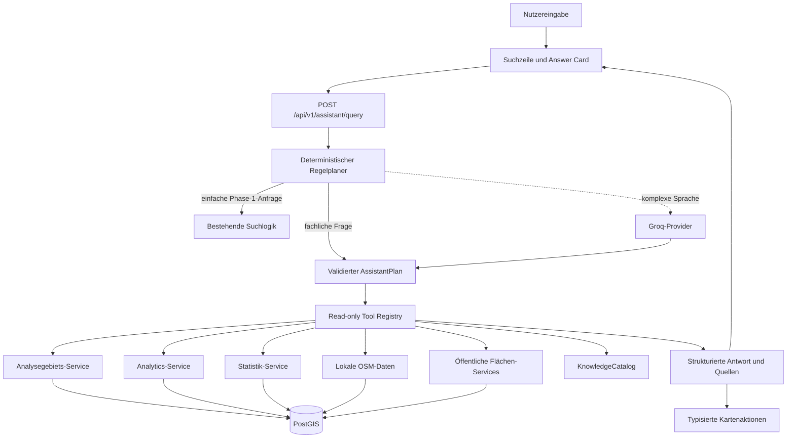

# Semantischer Stadtplaner-Assistent – Phase 3

## Zweck und Abgrenzung

Der Stadtplaner-Assistent kombiniert öffentliche, lesende Stadtplaner-Operationen zu belegbaren Antworten. Er erweitert die in [intelligent-search.md](intelligent-search.md) dokumentierte Phase 1. Die GIS-Karte bleibt die Hauptanwendung; der Assistent ergänzt die Suchzeile um kompakte Metrik-, Listen- und Vergleichskarten.

Phase 3 ergänzt Groq als primären austauschbaren Sprachprovider sowie einen kontrollierten KnowledgeCatalog. Nicht Bestandteil sind Embeddings, Vektordatenbanken, Websuche, generische SQL- oder OpenAPI-Agenten, Hintergrundagenten und schreibende KI-Aktionen.

## Architektur



Groq gehört ausschließlich zur Language Plane und übernimmt nur Sprachverständnis und Tool-Auswahl. PostGIS, die vorhandenen Services und der KnowledgeCatalog bilden die Data Plane und bleiben die fachliche Wahrheit. Einfache Suche, Knowledge-Fragen und bekannte kombinierte Fragen werden deterministisch geplant und benötigen keinen Provider-Aufruf.

## AssistantPlan und Ausführung

Ein `AssistantPlan` enthält ein Intent, einen Antwortmodus und eine geordnete Liste validierter Schritte. Pro Anfrage werden höchstens vier Tools ausgeführt. Es gibt keine Rekursion, Schleifen, Templates, JSONPath-Ausdrücke oder `eval()`-ähnliche Referenzen. Der Planer trägt bereits aufgelöste Slugs in die Folgeschritte ein.

Das Antwortformat enthält:

- `answer`: verständlicher deutscher Antworttext;
- `presentation`: unter anderem `TEXT`, `METRIC`, `COMPARISON`, `KNOWLEDGE`, `STATISTICS_OVERVIEW`, `STATISTIC_METRIC` oder `STATISTIC_SERIES`;
- `presentation.sections`: bis zu vier getrennte Ergebnisabschnitte, etwa Kennzahl plus kontrollierte Definition;
- `citations` und `sources_used`: interne Datenherkunft, keine Webquellen;
- `map_actions`: null bis mehrere typisierte Kartenaktionen;
- `context`: expliziter Kontext für die nächste Anfrage;
- `warnings` und datensparsame Telemetrie.
- `claims` mit strukturierter Evidence sowie typisierte `follow_up_actions`.

## Tool Registry

Nur folgende Werkzeuge sind registriert:

| Tool | Validierter Input | Typisiertes Ergebnis | Wiederverwendeter Service |
| --- | --- | --- | --- |
| `resolve_area` | Name oder Slug | Status, Gebiet oder Kandidaten | `AnalysisArea`-Gebietskatalog |
| `list_areas` | Gebietstyp, optional Parent-Slug | öffentliche Gebietsliste | `analysis_area_api.list_areas` |
| `get_area_detail` | Slug | öffentliche Gebietsdetails | `analysis_area_api.area_detail_by_slug` |
| `get_area_analytics` | Slug und Filter | aggregierte Kennzahlen | `analysis_area_api.area_analytics` |
| `get_area_statistics` | Slug | Statistik einschließlich Quelle und Vererbung | `area_statistics.area_statistics` |
| `get_statistic_series` | Slug und Kennzahlenschlüssel | typisierte Zeitreihe | `area_statistics.area_statistic_series` |
| `compare_areas` | zwei bis vier Slugs, Filter, Benchmark-Option | aggregierter Gebietsvergleich | `analytics.compare_areas` |
| `list_area_polygons` | Slug, Filter, Limit | öffentliche Flächen oder GeoJSON | Gebietsflächen-Service beziehungsweise bestehender Suchexecutor |
| `get_polygon_detail` | Slug | ausschließlich öffentliche Flächendetails | `polygons.public_polygon_by_slug` |
| `get_polygon_location` | Slug, 100 bis 2.000 Meter | lokale POI-Umfeldanalyse | `location_analytics.polygon_location_analysis` |
| `search_features` | Gebiet, Filter, Geometrietyp, Limit | maximal 200 GeoJSON-Objekte | bestehender sicherer Suchexecutor |
| `get_data_source_status` | keine Argumente | öffentlicher Importstatus | `area_statistics.statistics_source_status` |
| `search_knowledge` | Suchtext und Limit | kontrollierte Wissenseinträge | statischer `KnowledgeCatalog` |
| `get_concept` | Knowledge-Schlüssel | einzelner Wissenseintrag | statischer `KnowledgeCatalog` |
| `describe_category` | kanonische Kategorie | Kategorie und belegte Mappingquelle | `osm_canonical` und `KnowledgeCatalog` |
| `describe_metric` | Kennzahlenschlüssel | Definition und Herkunft | `KnowledgeCatalog` |
| `describe_filter` | Filterdimension | erlaubte Werte und Definitionen | Schemas und `KnowledgeCatalog` |
| `list_known_datasets` | keine Argumente | öffentliche Datenquellen | kontrollierte Quellenliste |
| `get_osm_feature_detail` | OSM-Typ und ID | deterministische Kategorie-/Occupancy-Erklärung | `osm_features`, `osm_canonical`, `osm_occupancy` |

Die Filterwerte entsprechen unverändert der bestehenden Taxonomie. Leere Listen bedeuten keine Einschränkung. `NONE` bleibt aus Kompatibilitätsgründen validierbar, wird vor Serviceaufrufen aber in die klare leere Semantik übersetzt.

## Explizit verbotene Bereiche

Die Registry enthält keine Tools für:

- `/api/v1/admin/*`;
- `/api/v1/auth/*`;
- `/api/v1/users/*`;
- `/api/v1/notifications/*`;
- `/api/v1/email/*`;
- fachlich schreibende `POST`-, `PUT`-, `PATCH`- oder `DELETE`-Operationen.

`POST /api/v1/analytics/compare` ist die einzige zugrunde liegende POST-Operation. Sie berechnet ausschließlich einen Vergleich und verändert keine Daten. Das Backend ruft dafür direkt den bestehenden Service auf.

## Halluzinationsschutz und Datenherkunft

Der Server erzeugt Zahlen und strukturierte Darstellungen direkt aus validierten Tool-Ergebnissen. Ein Sprachmodell darf sie nicht neu erzeugen. `null` wird weder als null Prozent noch als null Treffer interpretiert. Fehlt ein Wert, lautet die Antwort, dass keine belastbare Zahl vorliegt.

Statistikantworten führen Quelle, Periode und `inherited_from_parent` mit. Bei geerbten Daten weist der Antworttext auf das übergeordnete Gebiet hin. `UNKNOWN` bleibt eine eigene fachliche Kategorie. Datenbanktexte wie OSM- oder Flächennamen sind Daten und werden niemals als Instruktionen verarbeitet.

## Multi-Turn-Kontext

Der Client sendet pro Anfrage einen kleinen Kontext:

- aktives Gebiet;
- aktive Filter;
- zuletzt verglichene Gebiete;
- letztes Intent;
- letztes fachliches Thema.
- zuletzt eindeutig gewählter Statistikschlüssel und zuletzt verwendeter Quellentyp;
- optional ausgewählter öffentlicher Polygon-Slug oder eine OSM-Referenz;
- optional validierter Viewport mit Grenzen und Zoomstufe.

Damit funktionieren beispielsweise „Und wie viele in der Innenstadt?“ nach einer POI-Frage und „Nur Leerstände“ nach einer Gebietsauswahl. Der Server speichert kein verborgenes Gespräch und keine personenbezogenen Daten.

## Kommunale Statistik im Assistenten

Statistikfragen verwenden ausschließlich `get_area_statistics` und `get_statistic_series`. Der Assistent kennt eine begrenzte Aliasliste für die tatsächlich importierten Schlüssel, beispielsweise `population`, `households` und die veröffentlichten Alters- und Haushaltsgrößengruppen. Er erzeugt keine Kennzahlenschlüssel aus freiem Text. Passen mehrere Schlüssel, antwortet er mit einer Auswahl zur Präzisierung.

Eine Statistikantwort unterscheidet drei Darstellungen:

- `STATISTICS_OVERVIEW` zeigt die zuletzt veröffentlichten Kennzahlen eines Gebiets;
- `STATISTIC_METRIC` zeigt den letzten Wert einer eindeutig aufgelösten Kennzahl;
- `STATISTIC_SERIES` zeigt deren veröffentlichte Zeitreihe.

Alle drei Darstellungen transportieren das angefragte Gebiet, das tatsächlich verwendete Statistikgebiet, Quelle, Periode und `inherited_from_parent`. Eine Folgefrage wie „Und die Entwicklung?“ kann den zuletzt eindeutig gewählten Kennzahlenschlüssel verwenden. Definitionen und Quellenhinweise stammen aus dem kontrollierten KnowledgeCatalog und erscheinen als eigener Ergebnisabschnitt. Verweise enthalten nur freigegebene relative Projektpfade; die Oberfläche verlinkt bekannte Dokumentationspfade auf die interne Dokumentationsseite.

## Kartenaktionen

Der Assistent kann `FIT_AREA`, `SHOW_ANALYSIS_AREAS`, `HIGHLIGHT_AREAS`, `REPLACE_SEARCH_LAYER` und `UPDATE_FILTERS` liefern. Feature-Suchen verwenden den persistenten GeoJSON-Suchlayer. Räumliche Gebietssuchen verwenden eine indexierbare BBox als Vorfilter und anschließend `ST_Covers` für die exakte Zugehörigkeit.

## Sicherheit, Begrenzung und Datenschutz

- höchstens vier Tool-Aufrufe, üblich sind ein bis zwei;
- Pydantic-Validierung mit verbotenen Zusatzfeldern;
- statische Registry statt vollständiger OpenAPI;
- öffentliche Rate-Limits und PostgreSQL-Statement-Timeout;
- maximal 200 Kartenobjekte und höchstens vier Vergleichsgebiete;
- keine SQL-, URL-, Tabellen- oder Credential-Übergabe an Provider;
- Prompt-Injection- und Mutationsanfragen werden vor jedem Tool-Aufruf abgewiesen;
- Telemetrie protokolliert nur LLM-Nutzung, Modell, Tool-Anzahl, Dauer, Intent und Erfolg, nicht die vollständige Anfrage oder Tool-Ergebnisse.

Vorhandene fachliche Redis-Caches für Gebiete, Analytics, Statistik und Datenstatus werden weiterverwendet. Fertige LLM-Antworten werden nicht langfristig gecacht.

## Konfiguration und Fallback

Die Einbindung dieser Variablen in einen vollständigen Produktionsrollout ist im
[Deployment- und Betriebsleitfaden](deployment.md) beschrieben.

```dotenv
AI_SEARCH_ENABLED=false
AI_SEARCH_PROVIDER=groq
AI_SEARCH_MODEL=
GROQ_API_KEY=
GROQ_BASE_URL=https://api.groq.com/openai/v1
GROQ_TIMEOUT_SECONDS=8
GROQ_MAX_RETRIES=1
GROQ_TEMPERATURE=0.1
ASSISTANT_QUERY_LOGGING=false
```

API-Schlüssel werden als maskiertes Secret ausschließlich im Backend verarbeitet. Modell und Base-URL sind austauschbar; Preise oder Modellnamen sind nicht in der Fachlogik verankert. Bei `AI_SEARCH_ENABLED=false`, fehlendem Schlüssel, Timeout oder Providerfehler bleiben die deterministischen Phase-1/2/3-Pfade verfügbar. HTTP 429 und temporäre Serverfehler werden höchstens gemäß `GROQ_MAX_RETRIES` wiederholt; Tool-Ausführungen werden dabei niemals erneut ausgeführt.

Explizite numerische Flächenabfragen wie „Gibt es Flächen größer als 350 qm in
Flensburg?“ gehören zu diesen deterministischen Pfaden und benötigen keinen
Provider. Der Grenzwert wird ausschließlich auf die mit PostGIS vermessene
Polygonfläche gepflegter Stadtplaner-Flächen angewendet; OSM-Gebäudegrundrisse
werden nicht als Verkaufsfläche interpretiert.

HTTP-Fehler des Providers werden mit Statuscode, Modell, Versuch und dem
begrenzten Response-Body als Warning protokolliert. Dasselbe gilt für erfolgreiche
HTTP-Antworten, deren Struktur oder enthaltener Plan nicht validiert werden kann.
Der konfigurierte API-Schlüssel wird vor der Ausgabe durch `[REDACTED]` ersetzt;
Response-Texte werden nach 4.000 Zeichen gekürzt. Request-Header und der
Authorization-Header werden nicht protokolliert.

## Knowledge Retrieval und Versionierung

Der kleine Katalog wird beim Start aus expliziten fachlichen Einträgen aufgebaut. Quellen sind ausschließlich öffentlicher Domain-Code, öffentliche Schemas und die Dokumentation. `.env`, Auth-, User-, Admin-, E-Mail-, Audit- und Eigentümerdaten sind ausgeschlossen. Die Retrieval-Reihenfolge ist exakter Schlüssel, Alias, normalisiertes Textmatching und konservative Tippfehlerähnlichkeit. Confidence verwendet nur `EXACT`, `HIGH`, `AMBIGUOUS` und `NOT_FOUND`, keine erfundenen Prozentwerte.

Die Knowledge-Version ist ein stabiler Content-Hash; die Retrieval-Version wird separat geführt. Der Umfang ist klein, weshalb keine Embeddings, Migration und kein pgvector eingesetzt werden. Geometrien, Features, GeoJSON und laufend wechselnde Kennzahlen werden niemals in den KnowledgeCatalog übernommen.

## Evidence, Projektion und Erklärbarkeit

Jede belegte Antwort kann Claims mit Evidence aus Analytics, Vergleich, Statistik, OSM oder Knowledge enthalten. Tool-Ergebnisse werden auf öffentliche Felder projiziert. Eigentümerfelder, Verwaltungspreise, User-Daten, Auth-Daten, Cookies, Tokens und Secrets erreichen den Provider nicht. Große GeoJSON-Ergebnisse gehen direkt vom Backend an die Karte und nicht durch Groq.

OSM-Erklärungen verwenden die tatsächlichen Tags und die aktuelle kanonische Mappinglogik. Beispielsweise erklärt `amenity=restaurant` deterministisch die Kategorie `gastronomy`; `disused:shop=clothes` erklärt `VACANT`. `abandoned` und fehlende Lifecycle-Tags bleiben konservativ `UNKNOWN`.

## Prompt-, Tool- und Datenschutzgrenzen

Das Sprachmodell generiert niemals SQL und erhält keinen direkten Datenbankzugang. Die vollständige OpenAPI wird dem Modell nicht als Tool-Sammlung bereitgestellt. Nur die explizite read-only Tool-Allowlist ist verfügbar. Administrative, Auth-, User-, Benachrichtigungs-, E-Mail- und Schreiboperationen sind technisch nicht erreichbar. User Input, OSM-Namen und Knowledge-Inhalte bleiben als nicht vertrauenswürdige Daten vom versionierten Systemprompt getrennt.

Standardmäßig werden weder vollständige Nutzerfragen noch Prompts, Tool-Ergebnisse oder rohe OSM-Tags protokolliert. Davon ausgenommen sind die begrenzten und um den API-Schlüssel bereinigten Provider-Responses bei HTTP- oder Validierungsfehlern. Die Telemetrie enthält Provider, konfiguriertes Modell, Prompt-, Knowledge- und Tool-Registry-Version, Intent, Tool-Anzahl, Dauer, Erfolg und optional aggregierte Tokenzahlen ohne Personenbezug.

## Tests und Evaluation

Provider-Tests verwenden ausschließlich `httpx.MockTransport`; normale Tests verursachen keine Groq-Kosten. Retrieval, Synonyme, Tippfehler, Knowledge-Drift, Tool-Allowlist, Providerfehler, Secret-Maskierung, Prompt Injection, Null-/UNKNOWN-Semantik, kombinierte Fragen, Multi-Turn und Kartenaktionen besitzen Regressionstests. Das Evaluation-Dataset unter `backend/tests/fixtures/assistant_eval_cases.json` enthält mindestens 30 fachliche, mehrdeutige und sicherheitsrelevante Fälle.

## Lokaler Performance-Smoke-Test

Am 20. August 2026 wurde die Planungs- und Orchestrierungsschicht lokal jeweils 25-mal ausgeführt. Datenbank-, Redis-, HTTP- und Groq-Laufzeiten wurden dabei durch kontrollierte Service-Stubs ausgeklammert; die Werte sind deshalb keine Produktionslatenzen, sondern zeigen den Eigenaufwand des Assistenten. Die Antwort-Telemetrie liefert für reale Requests zusätzlich `duration_ms` und die tatsächliche Tool-Anzahl.

| Pfad | Mittlere lokale Laufzeit | Groq-Aufrufe | Tool-Aufrufe |
| --- | ---: | ---: | ---: |
| deterministischer Filter „Nur Leerstände“ | 0,12 ms | 0 | 0 |
| Knowledge „Was bedeutet Gastronomie?“ | 3,77 ms | 0 | 1 |
| Datenfrage zur Altstadt | 0,68 ms | 0 | 2 |
| kombinierte Daten-/Wissensfrage | 0,36 ms | 0 | 3 |
| Kartenfrage zur Altstadt | 0,60 ms | 0 | 2 |

Komplexe, nicht deterministisch auflösbare Sprache benötigt höchstens einen Groq-Planungsaufruf. Ein optionaler zweiter Formulierungsaufruf wird derzeit bewusst nicht verwendet. Reale Gesamtlaufzeiten werden vor allem durch Groq und die jeweils wiederverwendeten Stadtplaner-Services bestimmt.

## Bekannte Einschränkungen

Der Assistent kennt nur Stadtplaner-Daten und kontrolliertes Projektwissen. Es gibt keine Websuche, keine allgemeine Wissens-KI, keine Schreiboperationen, keine automatische OSM-Bearbeitung und keine vollständige OSM-Semantik außerhalb der vorhandenen Mappings. Fehlende Daten werden nicht geschätzt; Mehrdeutigkeit kann eine Rückfrage erfordern. Ein ausgewählter Viewport wird validiert, aber freie Viewport-Analysen ohne vorhandenes sicheres Data-Tool werden bewusst nicht erfunden.
